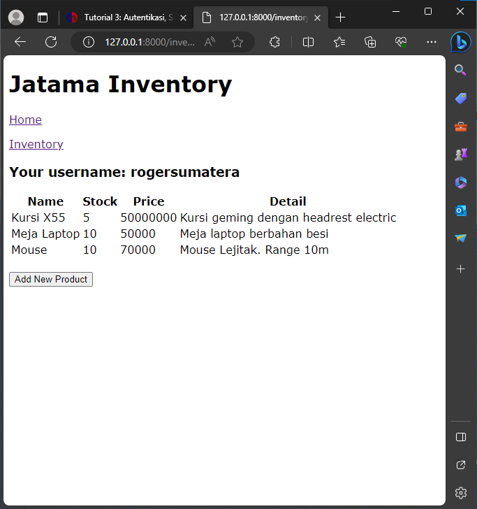

Checklist Tugas 2

No 1. Berikut langkah yang dibuat saat mengerjakan project ini

1. Buatlah folder project django yang ingin dibuat
2. Buka terminal dan install python
3. Install python virtual environment pada terminal. Jalankan python virtual environment agar project tidak mengalami konflik dependencies bila dibuka di perangkat dengan versi python yang lain
4. Buka terminal pada folder project django, lalu jalankan perintah " django-admin startproject "namafolder""
5. Buka folder project django yang telah dibuat dengan vscode. Buka terminal, lalu jalankan perintah python "manage.py startapp "nama aplikasi""
6. Buka settings.py pada folder project yang telah dibuat, tambahkan 'nama aplikasi' pada array INSTALLED_APPS
7. Buat folder baru pada folder main pada project django yang telah dibuat dengan nama templates. Isilah folder tersebut dengan file html yang ingin ditampilkan. Dalam hal ini, kami membuat 2 file html dengan nama main.html dan inventory.html.
8. Buka file models.py pada folder main
9. Buatlah kelas model yang ingin ditampilkan dalam aplikasi
10. Migrasikan data model lokal dengan menjalankan perintah "python manage.py makemigrations" untuk membuat model migrasi, lalu jalankan perintah "python manage.py migrate" untuk melakukan migrasi ke database lokal.
11. Buka file views.py, impor render dari package django.shortcuts lalu tambahkan fungsi yang meminta http dan merender page yang diinginkan
12. Buka file html yang ingin menampilkna data dari models.py, lalu masukkan {{variabel yang diinginkan}} pada file html
13. Untuk mengatur routing url aplikasi, buat file python dalam folder main dengan nama urls.py. Isi urls.py dengan mengimport path dari django.urls dan fungsi dari main.views yang ingin dibuat urlnya. Buatlah variabel nama aplikasi, kemudian buat array urlpatterns yang berisi path url yang ingin dibuat.
14. Untuk mengatur routing url project, buka urls.py pada folder project django, lalu import path dan fungsi include dari django.urls. Tambahkan "path('', include('main.urls'))," pada array urlpatterns mengimport url dari aplikasi main dan mengarahkan pada rute yang ditulis dalam berkas urls.py di folder main
15. Buatlah repository baru di Github
16. pada folder proyek django, jalankan perintah pada terminal
git init ., untuk menginisiasi repo lokal
git remote add origin "link repo github" untuk menghubungkan repository lokal dengan repository github yangtelah dibuat sebelumnya.
17. git add . untuk menambahkan progres repo, lalu tambahkan git commit -m "Pesan commit" untuk menambahkan pesan progres dari repository lokal. Lalu git push origin main untuk mempush dan mengirimkan file repository lokal ke repository github yang telah dibuat sebelumnya.[1]

No 2 [1]

No 3. Penggunaan virtual environment sebelum membuat project django sangat membantu karena virtual environment dapat mengisolasi projek, mempertahahkan dependencies yang dibutuhkan dalam project django yang dibuat, dan menghubungkan pip packages yang dibutuhkan. Hal ini bertujuan agar tidak memunculkan konflik antar package dan dependencies karena project tersebut dibuka di perangkat dengan versi python yang berbeda. Kita bisa membuat project django tanpa virtual environment, akan tetapi ini lebih memunculkan resiko untuk terjadinya konflik antar dependencies dan package apabila project yang dibuat tanpa mengaktifkan virtual environment dibuka di perangkat lain yang versi python nya berbeda.[2]

No 4. MVC adalah desain arsitektur yang memisahkan aplikasi menjadi tiga bagian, yaitu model, view, dan controller. Bagian model mengatur dan mengorganisasikan data pada database yang digunakan dalam aplikasi. Kemudian bagian view digunakan untuk me-render dalam bentuk GUI. Bagian controller berfungsi menghubungkan views dan model. Controller hanya memerintahkan bagian model dan berinteraksi dengan bagian view.
Sama seperti MVC, MVT merupakan desain arsitektur yang membagi aplikasi menjadi tiga bagian, yaitu bagian model, view, dan controller. MVT merupakan turunan dari desain arsitektur MVC. Bagian model berfungsi sebagai interaktor terhadap data aplikasi yang bertugas me-maintance data aplikasi. Bagian ini berisi data struktur logik dan ditampilkan dalam bentuk database. Bagian view sebagai pengontrol apa yang akan ditampilkan saat merender aplikasi dan menerima permintaan HTTP dan mengembalikan respon HTTP. Bagian template merupakan bagian front-end dari aplikasi yang berisi file HTML
MVVM, yaitu Model View ViewModel, yaitu desain arsitektur perangkat lunak yang terdiri dari tiga bagian. Yaitu Model, View, dan ViewModel. Bagian model berfungsi melakukan aktivitas abstraksi data yang digunakan. Bagian View berfungsi untuk memberikan informasi kepada bagian ViewModel setelah menerima respon dari user. Bagian ViewModel berfungsi menghubungkan antara data yang diberikan oleh user dengan Model dan merepresentasikan data yang disimpan pada bagian model. Perbedaan ketiganya yaitu, MVC memiliki Bagian Controller untuk mengatur user response, sedangkan pada MVT, tugas itu langsung dilakukan oleh Bagian View. Sedangkan pada MVVM, tugas tersebut dilakukan ole Bagian View, hanya saja Bagian View hanya seolah-olah menjadi perantara masuknya response dari user.[3]

Sumber : 
1. https://docs.djangoproject.com/en/4.2/
2. https://csguide.cs.princeton.edu/software/virtualenv#:~:text=In%20a%20nutshell%2C%20Python%20virtual,or%20used%20by%20other%20projects.
3. https://www.geeksforgeeks.org/difference-between-mvc-mvp-and-mvvm-architecture-pattern-in-android/

################################################

Tugas 3: Implementasi Form dan Data Delivery pada Django

No 1. Apa perbedaan antara form POST dan form GET pada Django
Perbedaan antara form POST dan form GET pada Django adalah form POST dikembalikan oleh method POST yang digunakan untuk request yang bisa mengubah state dari sistem aplikasi, contohnya adalah mengubah database. Sedangkan form GET merupakan form yang didapat dari method GET yang digunakan hanya untuk request yang tidak mengubah state dari sistem aplikasi.

No 2. Apa perbedaan utama antara XML, JSON, dan HTML dalam konteks pengiriman data?
XML menjadi tempat penyimpanan dan transmisi data yang diinput dan lebih kompleks karena membutuhkan struktur tag. Sedangkan JSON merupakan tempat penyimpanan dan transmisi data yang lebih mudah dan simpel digunakan karena tidak menggunakan tag sehingga mudah dibaca. Sedangkan HTML berfokus pada cara menampilkan data yang telah diinput.
 
No 3. Mengapa JSON sering digunakan dalam pertukaran data antara aplikasi web modern?
JSON lebih sering digunakan pada web modern karena JSON lebih mudah di-parse tanpa tambahan kode, memiliki ukuran file yang lebih kecil, pertukaran data yang lebih cepat, dan text-based.

No 4. Jelaskan bagaimana cara kamu mengimplementasikan checklist di atas secara step-by-step (bukan hanya sekadar mengikuti tutorial).
- Jalankan virtual environment terlebih dahulu
- Buat file html baru bernaam base sebagai kerangka web baru. Isi dengan menambahkan kerangka file html seperti biasa,  pada baris pertama,   dan  dalam tag head, dan   dan  dalam tag body
- Buka settings dan tambahkan [BASE_DIR / 'templates'], pada object DIRS dalam TEMPLATES
- Buat file baru bernama forms.py untuk membuat struktur form yang menerima data baru.
- Buka views.py, lalu buat fungsi baru berparameter request yang menghasilkan formulir yang bisa menambahkan data ketika data disubmit
- Ubah fungsi show_main pada views.py dengan menambahkan products = Product.objects.all() dan assign products ke object product yang telah dibuat sebelumnya
- buka urls.py di folder main, import fungsi baru sebelumnya yang dibuat
- tambahkan path dalam urlpatterns pada urls.py di folder main untuk mengakses fungsi yang telah diimport
- Buat file html baru dengan nama create product dan isi dengan menambahkan form POST dengan tag table berdasarkan file form.py dan tag input submit
- Buka main.html dan tambahkan kode yang akan ditampilkan di block content untuk menampilkan data dan tombol add new product
- Buka views.py dan import HttpResponse dan Serializer
- buat fungsi baru dengan nama show_xml. Tambahkan variabel beranam data untuk menyimpan hasil query. Return fungsi berupa HttpResponse berisi parameter data hasil query berupa XML dan parameter content_type berupa xml
- Import fungsi show_xml dan tambahkan path url show_xml pada urls.py
- Jika ingin mengembalikan data berdasarkan id, buat fungsi yang sama lalu ubah nama fungsi dengan berdasarkan id, lalu ubah variabel data dengan Product.objects.filter(pk=id). Hasil return function berupa HttpResponse berisi parameter yang sama. Tambahkan path url yang berbeda untuk mengakses fungsi baru tadi 
- Untuk mengembalikan data dalam bentuk JSON, cara hampir sama dengan cara di atas. Yang membedakan adalah isi fungsi serializer.serialize berupa string json dan content_type nya adalah "application/json". Hal ini juga sama untuk mengembalikan data JSON berdasarkan ID
- Buka POSTman, buat request baru dengan method GET dan url http://localhost:8000/xml atau http://localhost:8000/json.
- Klik tombol send
- Hasil response dari request dapat dilihat pada bagian bawah Postman

screenshot postman

HTML

XML

JSON

XML by id

JSON by id

checklist Tugas 4

No 1. Django UserCreationForm, kelebihan dan kekurangan
Django UserCreationForm merupakan ModelForm turunan dari BaseUserCreationForm yang membuat user baru setelah menerima perintah. UserCreationForm memiliki tiga fields, yaitu username, password1, dan password2. Password2 ini digunakan untuk memverifikasi ulang password1 yang ingin didaftarkan. UserCreationForm Kelebihan dari UserCreationForm adalah class ini mencegah pengguna untuk mendaftarkan username baru yang sama dan bersifat case insensitive. Kekurangannya adalah usercreationform tidak memiliki field email yang berguna untuk memverifikasi akun pengguna melalui email dan apabila user lupa dengan password, user dapat mereset password akun pada email user

No2. Perbedaan antara authentication dengan authorizaton adalah Authentication memverifikasi apakah user memang benar telah mendaftarkan akunnya ke dalam sistem. Sedangkan authorization mengatur hal apa saja yang bisa dilakukan oleh akun user yang telah didaftarkan. Peran keduanya sangat penting dalam pengembangan webstie. Authentication memfilter pengguna yang mengakses website sehingga hanya user yang teregistrasi saja yang bisa masuk dan mengakses fitur-fitur dalam website. Sedangkan authorization memberikan access privilege kepada user sehingga user memiliki role masing-masing. Setiap user memiliki hak akses yang berbeda-beda sehingga tidak terjadi penyalahgunaan hak akses oleh user. 

No3. Cookies merupakan informasi dalam bentuk file kecil yang digenerate dan dikirim dari dan menuju web yang disimpan sementara atau selama user berada pada sessionnya di dalam website. Cookies membantu website menginformasikan informasi terkait dengan profil pengguna dan apa saja yang dibuka dan disimpan dalam website. 

No 4. Cookies tidak berbahaya dalam penggunaan web karena cookies tidak menyimpan informasi penting terkait pengguna dan hanya menyimpan informasi terkait dengan penggunaan web oleh pengguna, seperti riwayat pencarian, riwayat akses fitur, dsb. Akan tetapi, Cookies memiliki beberapa resiko. Data cookies bisa dimanfaatkan oleh peretas sebagai raw data untuk menemukan gambaran dari profil pengguna yang bisa menjadi jalan untuk meretas data pengguna tersebut.

No 5.
- Buka terminal dan jalankan python environment
- Buka file views.py pada folder main. Import redirect, usercreationfrom, dan messages 
- Buat fungsi register yang menghasilkan form registrasi dan menghasilkan akun baru
- Buat file html baru dengan nama register.html sebagai halaman registrasi.
- Buka urls.py pada folder main. Import fungsi register yang telah dibuat di views.py dan tambahkan path yang mengakses fungsi register
- Buat fungsi register dengan membuka views.py. Import authenticate dan login. Lalu tambahkan fungsi login yang mengautentikasi user yang meminta username dan password yang telah dibuat.
- Buat file html baru bernama login.html berisi form yang menuju ke main.html dalama status login.
- Buka urls.py. Import fungsi login yang telah dibuat di views.py. Tambahkan path login ke dalam urlspatterns
- Untuk membuat fitur logout, buka views.py. Import modul logout. Buat fungsi log out yang melogout user. Kemudian buka file urls.py. Import fungsi log out yang telah dibuat lalu tambahkan url log out ke urlspatttern.
- Tambahkan button logout ke dalam main.html
- Untuk membatasi akses halaman main, buka views.py lalu import login_required, lalu tambahkan "@login_required(login_url='/login')"di atas fungsi show_main
- Untuk membuat cookie pada app django, buka views.py lalu import datetime, HttpResponseRedirect, dan reverse. Set cookie dengan menambahkan "response = HttpResponseRedirect(reverse("main:show_main"))"  dan    "response.set_cookie('last_login', str(datetime.datetime.now()))" dalam fungsi login
- Untuk melihat hasilnya, tambahkan " 'last_login': request.COOKIES['last_login']," ke variabel context pada fungsi show main
- Tambahkan beberapa kode ini dalam fungsi logout:
    "response = HttpResponseRedirect(reverse('main:login'))"
    "response.delete_cookie('last_login')" 
- Tambahkan variabel last_login ke dalam main.html
- Untuk menghubungkan model data dengan user, buka models.py. Import user lalu tambahkan kode ini dalam class Product
"user = models.ForeignKey(User, on_delete=models.CASCADE)"
- Buka views.py pada folder main, tambahkan kode ini dalam fungsi create_product "product = form.save(commit=False)
     product.user = request.user"
- Ubah name pada fungsi show main menjadi request.user.username. Filter product yang ingin ditampilkan di show_inventory dengan menambahkan kode berikut " products = Product.objects.filter(user=request.user)"
- Migrasi model dengan menjalankan perintah python manage.py makemigrations. Pilih 1. Dan ketik angka 1. Lalu terapkan migrasi dengan menjalankan perintah di terminal python manage.py migrate

- Bukti 2 akun 3 data dummy

Jawaban Pertanyaan Tugas 5
No 1. Manfaat dari setiap element selector adalah memberikan dan mengubah properti styling pada elemen dalam html baik hanya pada satu jenis elemen saja ataupun semua elemen yang memiliki tag yang sama.

No 2. HTML5 tag yang diketahui seperti tag "<header>" yaitu tag yang merupakan bagian awal dari body. Kemudian tag <main> yang merupakan tag yang menjadi tempat tag elemen konten utama. Kemudian terdapat tag <footer> yang merepresentasikan bagian footer dari website.

No. 3 Perbedaan antara padding dan margin adalah padding merupakan jarak tepi antara elemen-elemen html dalam suatu elemen html. Sedangkan margin merupakan jarak tepi suatu elemen html pada bagian luarnya.

No 4. Perbedaan antara framework CSS Tailwind dan Bootstrap adalah Tailwind lebih bisa dicustomize dan fleksibel. Sedangkan Bootstrap lebih terstruktur dalam desainnya. Tailwind perlu melakukan beberapa tahap penginstalan modul sebelum digunakan dalam html. Sedangkan bootstrap hanya perlu menambahkan script untuk menginstall bootstrap 

No 5.
- Jalankan virtual environment
- Buka views.py lalu buat fungsi baru dengan nama edit_product agar produk yang telah didaftar dapat diubah
- Buat file html baru dengan nama edit_product.html pada folder template
- Buka urls.py import edit_product yang telah dibuat lalu tambahkan path untuk edit_product
- Buka file inventory.html. Tambahkan button untuk mengarahkan ke page edit produk
- Buat fitur delete_product dengan menambahkan fungsi delete product pada views.py . Buka urls.py lalu import fungsi tersebut dan tambahkan path urlnya
- Buat tombol pada inventory.html yang menghapus produk yang ditambah

- Karena proyek ini menggunakan tailwind css. Berikut cara installnya
- Jalankan python environment
- Install django-tailwind dengan python -m pip install django-tailwind
- lalu install django-browser-reload dengan cara yang sama
- Buka settings.py ke array InstalledApp dan tambahkan tailwind
- Buat tailwind css khusus untuk django app dengan menjalankan python manage.py tailwind init. Akan muncul folder baru bernama theme
- Lalu tambahkan theme ke INSTALLED_APPS dalam file settings.py
- tambahkan line baru dalam setting.py. "TAILWIND_APP_NAME = 'theme'"
- Tambah array berikut "INTERNAL_IPS = [
    "127.0.0.1",
]"
- Install tailwind dependencies
- Buka base.html dan tambahkan   pada head
- tambahkan django_browser_reload pada INSTALLED_APPS dalam file settings.py
- tambahkan ""django_browser_reload.middleware.BrowserReloadMiddleware"," pada MIDDLEWARE di file settings.py
- Buka urls.py, import include dan path. Tambahkan path reload dari django browser reload. 

- Agar style yang telah dikustom dapat dilihat, jalanakan python manage.py tailwind start dan python manage.py runserver pada terminal secara bersamaan.